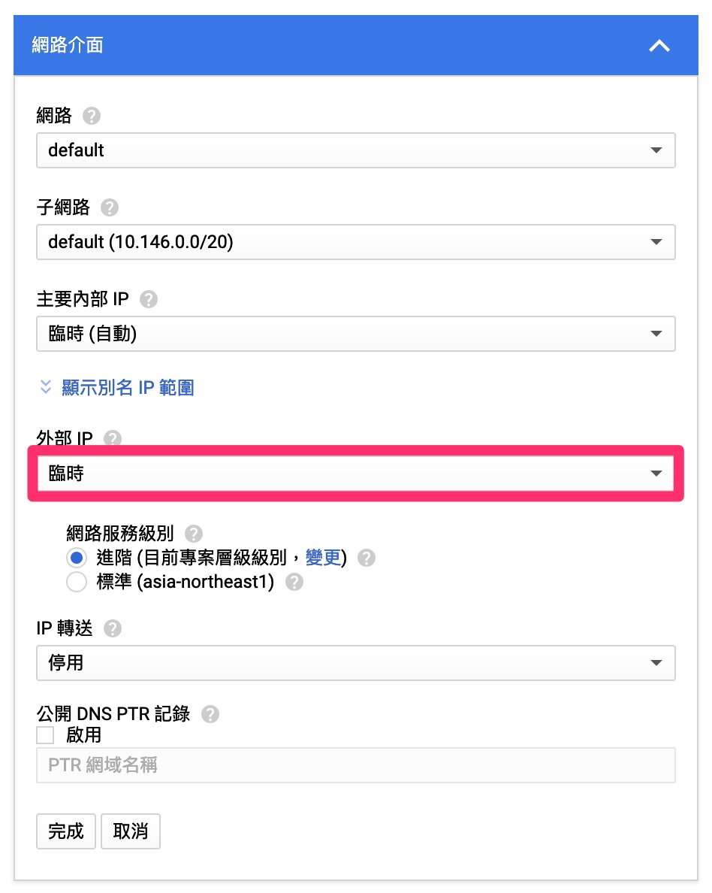

# GCP 架設 SSR 伺服器

- [GCP 架設 SSR 伺服器](#gcp-%e6%9e%b6%e8%a8%ad-ssr-%e4%bc%ba%e6%9c%8d%e5%99%a8)
  - [前言](#%e5%89%8d%e8%a8%80)
    - [實作日期](#%e5%af%a6%e4%bd%9c%e6%97%a5%e6%9c%9f)
    - [前置作業與需求](#%e5%89%8d%e7%bd%ae%e4%bd%9c%e6%a5%ad%e8%88%87%e9%9c%80%e6%b1%82)
    - [關於 GCP](#%e9%97%9c%e6%96%bc-gcp)
  - [操作步驟](#%e6%93%8d%e4%bd%9c%e6%ad%a5%e9%a9%9f)
    - [1. 建立 Google 帳號並綁定信用卡](#1-%e5%bb%ba%e7%ab%8b-google-%e5%b8%b3%e8%99%9f%e4%b8%a6%e7%b6%81%e5%ae%9a%e4%bf%a1%e7%94%a8%e5%8d%a1)
    - [2. 設置防火牆](#2-%e8%a8%ad%e7%bd%ae%e9%98%b2%e7%81%ab%e7%89%86)
    - [3. 新增並管理 VM 執行個體](#3-%e6%96%b0%e5%a2%9e%e4%b8%a6%e7%ae%a1%e7%90%86-vm-%e5%9f%b7%e8%a1%8c%e5%80%8b%e9%ab%94)
    - [4. 在 VM 中開啟 BBR 加速](#4-%e5%9c%a8-vm-%e4%b8%ad%e9%96%8b%e5%95%9f-bbr-%e5%8a%a0%e9%80%9f)
    - [5. 安裝 SSR](#5-%e5%ae%89%e8%a3%9d-ssr)
  - [參考資料](#%e5%8f%83%e8%80%83%e8%b3%87%e6%96%99)

---

## 前言

<details><summary><i>預設將內容隱藏，讓你更快看到操作步驟，點擊此處以展開。</i></summary>

### 實作日期

- 2020/2/20(四)
- 注意：隨時間演變，介面與指令可能會與我的介紹有所不同，但基本上大同小異

### 前置作業與需求

- Google 帳號
- 信用卡或金融卡（以下簡稱信用卡）

### 關於 GCP

- Google Cloud Platform（以下簡稱 GCP）是 Google 提供的雲端平台，它以安全、穩定、快速著稱，你可以將它想像成執行在遠端的主機，能執行多種應用。
- 每個帳號第一次綁定信用卡時，會贈送 1 年 $300 美元的試用額度，對於架設 SSR 伺服器來說相當夠用。
- 你或許會擔心綁定信用卡會被扣款，但只要不升級為完整帳戶，它都只會使用贈送的 $300 美元額度。

</details>

## 操作步驟

> 註：由於筆者已經註冊過，因此無法完整演示過程，但會盡可能模擬。

### 1. 建立 Google 帳號並綁定信用卡

1-1. 前往 [cloud.google.com/free?hl=zh-tw](https://cloud.google.com/free?hl=zh-tw) ，點擊「開始免費使用」


1-2. 登入你的 Google 帳號（或也可以註冊新帳號）


1-3. 國家/地區選擇「台灣」，勾選服務條款，並點擊「繼續」


1-4. 選擇「建立付款資料」，帳戶類型為「個人」，稅務資訊「魏登記稅籍的個人」，其他照實填寫。


1-5. 填寫信用卡資訊（**注意：每張信用卡與帳號僅有一次試用機會**）


### 2. 設置防火牆

2-1. 前往 [console.cloud.google.com/networking/firewalls/list?hl=zh-tw](https://console.cloud.google.com/networking/firewalls/list?hl=zh-tw) 建立新的防火牆規則


2-2. 設定名稱為 `allow-all-ip-ports`，目標為「網路中的所有執行個體」，來源 IP 範圍 `0.0.0.0/0`（別忘了結尾後的 `/0`），通訊協定和通訊埠為「全部允許」，最後點擊建立


### 3. 新增並管理 VM 執行個體

3-1. 前往 [console.cloud.google.com/compute/instances?hl=zh-tw](https://console.cloud.google.com/compute/instances?hl=zh-tw)，點擊「建立執行個體」


3-2. 按圖片指示操作

> 註：筆者示範翻牆至日本東京

- 名稱可以自由命名，區域則按照需求選擇
- 機器設定會影響效能，一般使用選擇「f1-micro」即可；開機映像檔需更改為「CentOS 7」
- 最後點擊「管理、安全性、磁碟、網路、單獨租用」，先不要點擊建立


3-3. 上一步點擊「管理、安全性、磁碟、網路、單獨租用」後，按下圖指示依序點擊「網路」標籤與「網路介面」


3-4. 修改「外部IP」的配置



3-5. 點擊「建立 IP 位址」


3-6. 按需求命名，並點擊「保留」


> 註：保留靜態 IP 能避免每次重開機會更換新的位址，進而造成客戶端裝置連接時需重新設置。

3-7. 點擊網路介面中的「完成」


3-8. 點擊「建立」並稍待片刻


### 4. 在 VM 中開啟 BBR 加速

4-1. 找到剛才建立的 VM 執行個體，並點擊「SSH」連接機器來操作


> 如果關掉剛才的網頁的話，也可在[此處](https://console.cloud.google.com/compute/instances?hl=zh-tw)找到剛才建立的 VM 執行個體

4-2. 稍待片刻，連接完成後應會出現下圖畫面：


4-3. 輸入 `sudo -i` 切換至 root 使用者

> 在 Linux 系統中，root 使用者擁有最高的權限，能修改系統的配置。但因為安全緣故，因此預設是使用一般使用者的帳號登入。

- 一般使用者前綴為 `$`，root 使用者為 `#`

```
[user@ssr-tokyo ~]$ sudo -i
[root@ssr-tokyo ~]# 
```

4-4. 一次一行依序執行以下命令，以安裝並啟用 BBR 加速腳本

```
yum install -y wget
wget --no-check-certificate https://git.io/vbUk0
chmod +x bbr.sh
./bbr.sh
```

4-5. 見到以下畫面時，點擊任意鍵繼續安裝

> 安裝過程需花幾分鐘，請稍待片刻

```
---------- System Information ----------
 OS      : CentOS 7.7.1908
 Arch    : x86_64 (64 Bit)
 Kernel  : 3.10.0-1062.9.1.el7.x86_64
----------------------------------------
 Auto install latest kernel for TCP BBR

 URL: https://teddysun.com/489.html
----------------------------------------

Press any key to start...or Press Ctrl+C to cancel
```

4-6. 見到以下畫面時，代表安裝成功。此時輸入 `y` 並按下 Enter 來重新啟動。

```
Complete!

Info: The system needs to reboot.
Do you want to restart system? [y/n]
```

4-7. 此時與機器的連線會斷開，等待機器開機完成後，點擊「重新連線」

> 若此視窗不慎關閉，可在[步驟 4-1](#4-%e5%9c%a8-vm-%e4%b8%ad%e5%ae%89%e8%a3%9d%e8%85%b3%e6%9c%ac) 查看機器開機狀態與透過 SSH 連線


4-8. 重新連接後，輸入 `lsmod | grep bbr` 後，若有顯示回傳內容，代表 BBR 加速成功開啟。

```
[user@ssr-tokyo ~]$ lsmod | grep bbr
tcp_bbr                20480  11
```

### 5. 安裝 SSR

5-1. 同步驟 4-3，輸入 `sudo -i` 切換至 root 使用者

```
[user@ssr-tokyo ~]$ sudo -i
[root@ssr-tokyo ~]# 
```

5-2. 一次一行依序執行以下命令，以安裝並啟用 SSR 腳本

```
wget --no-check-certificate -O shadowsocks-all.sh https://git.io/vH4OV
chmod +x shadowsocks-all.sh
./shadowsocks-all.sh 2>&1 | tee shadowsocks-all.log
```

5-3. 選擇要安裝的伺服器版本，這邊推薦選 `2`

```
Which Shadowsocks server you'd select:
1) Shadowsocks-Python
2) ShadowsocksR
3) Shadowsocks-Go
4) Shadowsocks-libev
Please enter a number (Default Shadowsocks-Python): 2
```

5-4. 設定密碼，建議至少 8 碼

```
Please enter password for ShadowsocksR
(Default password: teddysun.com):
```

5-5. 設定連接埠，這邊可直接按 Enter 選擇預設的 11764 埠號（此數字可能隨電腦而異）

```
Please enter a port for ShadowsocksR [1-65535]
(Default port: 11764):
```

5-6. 選擇加密方式，這邊推薦直接按 Enter，選擇預設的 `aes-256-cfb`

```
Please select stream cipher for ShadowsocksR:
1) none
2) aes-256-cfb
3) aes-192-cfb
4) aes-128-cfb
5) aes-256-cfb8
6) aes-192-cfb8
7) aes-128-cfb8
8) aes-256-ctr
9) aes-192-ctr
10) aes-128-ctr
11) chacha20-ietf
12) chacha20
13) salsa20
14) xchacha20
15) xsalsa20
16) rc4-md5
Which cipher you'd select(Default: aes-256-cfb):
```

5-7. 選擇協議，推薦直接按下 Enter，選擇預設的 `origin` 即可

```
Please select protocol for ShadowsocksR:
1) origin
2) verify_deflate
3) auth_sha1_v4
4) auth_sha1_v4_compatible
5) auth_aes128_md5
6) auth_aes128_sha1
7) auth_chain_a
8) auth_chain_b
9) auth_chain_c
10) auth_chain_d
11) auth_chain_e
12) auth_chain_f
Which protocol you'd select(Default: origin):
```

5-8. 選擇 obfs（混淆協議），推薦直接按下 Enter，選擇預設的 `plain` 即可

```
Please select obfs for ShadowsocksR:
1) plain
2) http_simple
3) http_simple_compatible
4) http_post
5) http_post_compatible
6) tls1.2_ticket_auth
7) tls1.2_ticket_auth_compatible
8) tls1.2_ticket_fastauth
9) tls1.2_ticket_fastauth_compatible
Which obfs you'd select(Default: plain):
```

5-9. 按下任意鍵來安裝，並稍待片刻（需要一段時間）

```
Press any key to start...or Press Ctrl+C to cancel
```

5-10. 見到以下畫面時，代表安裝成功！（機密資訊以 `*` 隱藏）

```
Starting ShadowsocksR success

Congratulations, ShadowsocksR server install completed!
Your Server IP        :  ***.***.***.***
Your Server Port      :  *****
Your Password         :  ********
Your Protocol         :  origin 
Your obfs             :  plain 
Your Encryption Method:  aes-256-cfb 

Your QR Code: (For ShadowsocksR Windows, Android clients only)
 ssr://**********
Your QR Code has been saved as a PNG file path:
 /root/shadowsocks_r_qr.png 

Welcome to visit: https://teddysun.com/486.html
Enjoy it!
```

## 參考資料

1. [GitHub - teddysun/across: Across the Great Wall we can reach every corner in the world](https://github.com/teddysun/across)
2. [Google Cloud Platform免費申請&一鍵搭建SSR & BBR加速教程 - 外貿SOHO筆記](https://www.wmsoho.com/google-cloud-platform-ssr-bbr-tutorial/)
3. [安裝梯子 - 外貿SOHO筆記](https://www.wmsoho.com/install-shadowsocks/)
